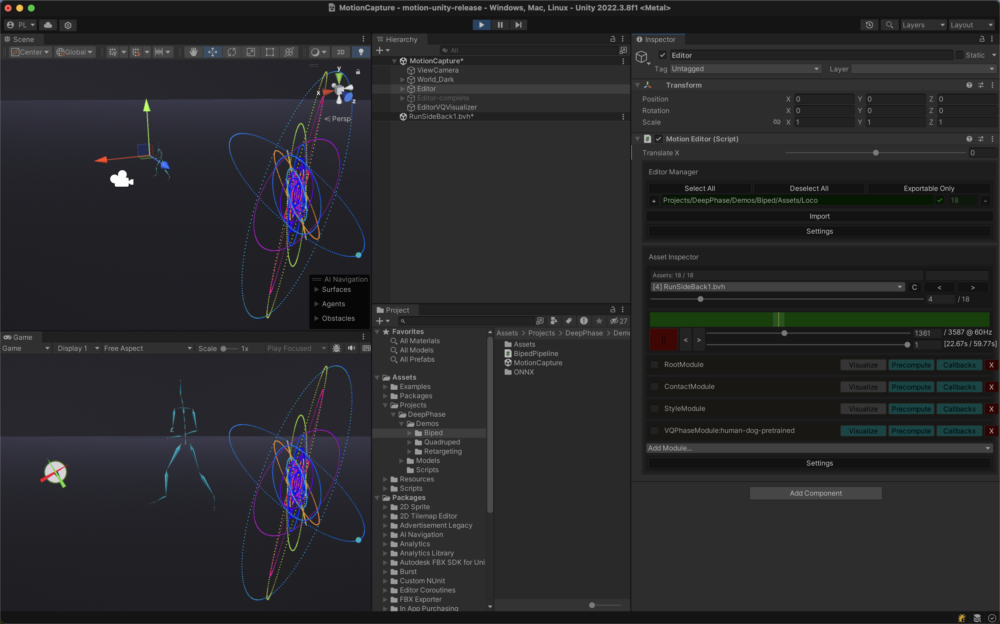
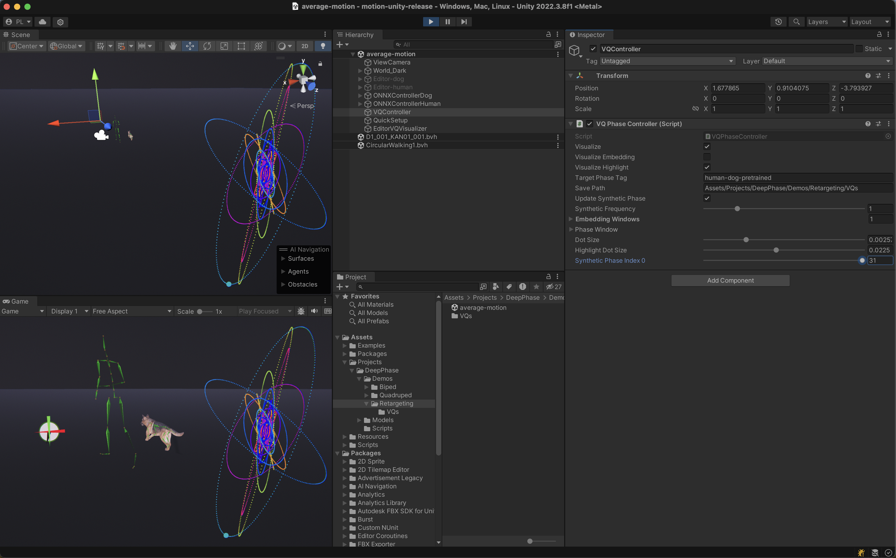

# Unity Framework for WalkTheDog

This repository provides the Unity framework used in [WalkTheDog: Cross-Morphology Motion Alignment via Phase Manifolds](https://peizhuoli.github.io/walkthedog/index.html) for data processing, visualization and demos. 

## Prerequisites

Clone the repository:

```bash
git clone https://github.com/PeizhuoLi/walk-the-dog-unity.git
```

Download the pre-processed motion data and pre-trained models from [Google Drive](https://drive.google.com/file/d/1wO-AE6dNyXvm-dHelNP6nn--yOy5mDGk/view?usp=sharing), extract it and put it under `Assets/Projects/DeepPhase/Demos`.

Open the project with Unity. The project is developed with Unity 2022.3.8f1 Apple Silicon version.


## Quick Start

### Phase Manifold Visualization

Open the scene `Assets/Projects/DeepPhase/Demos/Biped/MotionCapture`. Hit the play button, and activate the `Visualize` button of `VQPhaseMnaiofld:human-dog-pretrained` in the Inspector of `Editor`.



Similarly, you can visualize the phase manifold of the dog model by using `Assets/Projects/DeepPhase/Demos/Quadruped/MotionCapture`


### Average Pose Visualization

Open the scene `Assets/Projects/DeepPhase/Demos/Retargeting/average-motion` and hit the play button.

You can switch between different connected components of the phase manifold by changing the `Synthetic Phase Index 0` in the Inspector of `VQController`.





### Motion Matching

Coming soon.


## Use Customized Data

### Pre-process Data

1. Use `AI4Animation -> Importer -> BVH Importer` in the menu bar for BVH files and FBX Importer for FBX files.

2. Duplicate the scene `Assets/Projects/DeepPhase/Demos/Biped/MotionCapture`. In the Inspector of `Editor`, put the path for imported data in Editor Manager in the Inspector of `MotionEditor` and hit `Import`.

3. Use `AI4Animation -> Tools -> Pre Process` to calculate the root coordinate.

### Export Data for Training

Use `AI4Animation -> Tools -> Data Exporter (Async)` to export the pre-processed data.

For `Editor`, choose the MotionEitor containing all the data you need.

For `Exporting Mode`, use `Velocities,Positions,Rotations` 

Check `Use Butterworth Velocity Only` option.

You can use the default settings for the rest of the options.

### Train the Model

Please refer to the [Python module](https://github.com/PeizhuoLi/walk-the-dog) for more information.

### Import a Trained Model

If you are using human and dog datasets, you can use the Joint Importer (AI4Animation -> Importer -> Joint (Async)) to import the pre-trained model. We use `Tag` as the name of the learned phase manifold, and it is used in the visualizer, ONNX executer.

Set `Phase Path` to the directory containing the trained model, Dataset Prefix to the directory containing the exported dataset, and `Tag` to a name for the phase manifold.

If you are using a customized dataset, use `AI4Animation -> Importer -> VQ Phase Importer` to import the learned phase. Leave `Dataset Prefix`, set `Preset Sequence` to Customize, `Sequence Path` to the `Sequences.txt` file exported by the data exporter, `Phase Path` to the `.npz` file exported by the training script.

### Visualize the Phase Manifold and Average Pose

If you use the human-dog dataset, open the scene `Assets/Projects/DeepPhase/Demos/Retargeting/average-motion`. In the Insector of `QuickSetup`, change the Target Phase Tag to the name of the phase manifold you imported, and hit `Apply Setup` button.

If you are using a customized dataset, please refer to the detailed implementation of [ApplySetup()](https://github.com/PeizhuoLi/walk-the-dog-unity/blob/main/Assets/Projects/DeepPhase/Scripts/QuickSetup.cs#L294) function.


## Acknowledgments

The code is adapted from the [DeepPhase](https://github.com/sebastianstarke/AI4Animation/tree/master?tab=readme-ov-file#siggraph-2022deepphase-periodic-autoencoders-for-learning-motion-phase-manifoldssebastian-starkeian-masontaku-komuraacm-trans-graph-41-4-article-136) project under [AI4Animation](https://github.com/sebastianstarke/AI4Animation/tree/master/AI4Animation/SIGGRAPH_2022/Unity) by [@sebastianstarke](https://github.com/sebastianstarke).

The code under `Assets/Scripts/Animation/Intertialization` is adapted from [MotionMatching](https://github.com/JLPM22/MotionMatching) by Jose Luis Ponton ([@JLPM22](https://github.com/JLPM22)).